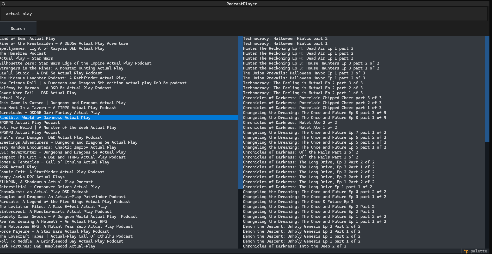
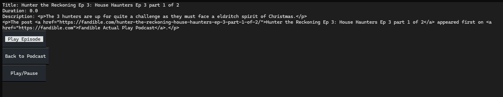

# ChatGPT TUI Podcast Player

## Overview

I sat down with ChatGPT to see how far we would get in generating a TUI-based Podcast Player.

To my moderate suprise, I got something functional.

Some things went amazingly well.

Other things went less well, but not inherently bad.

## Screenshots

## Reflection

TODO:

## Licence

Public Domain I guess. I'm certainly not claiming any copyright on this.
